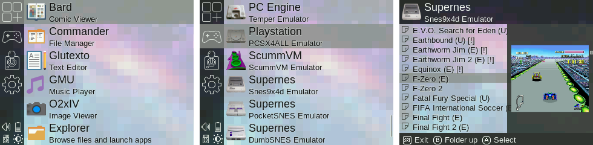
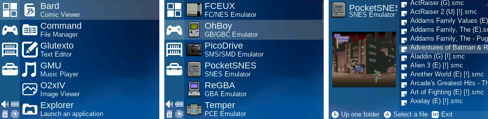
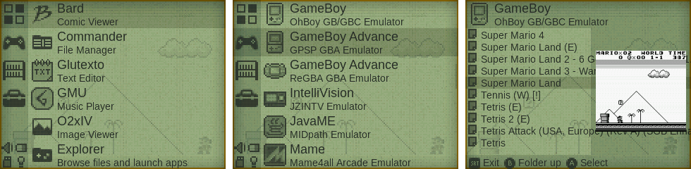
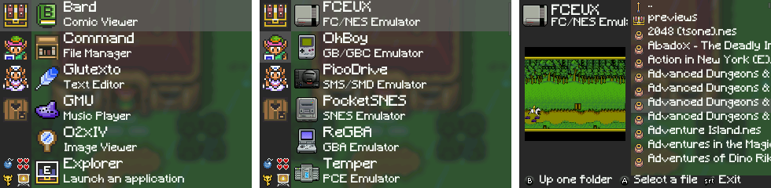
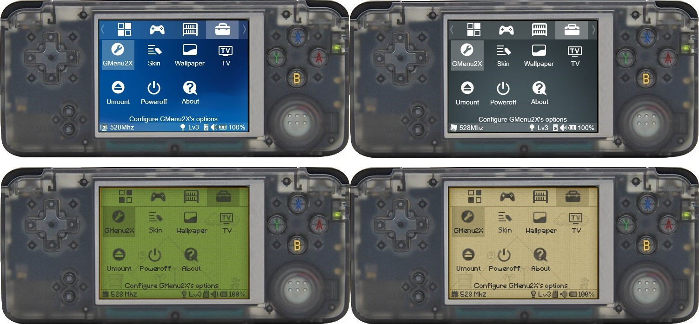
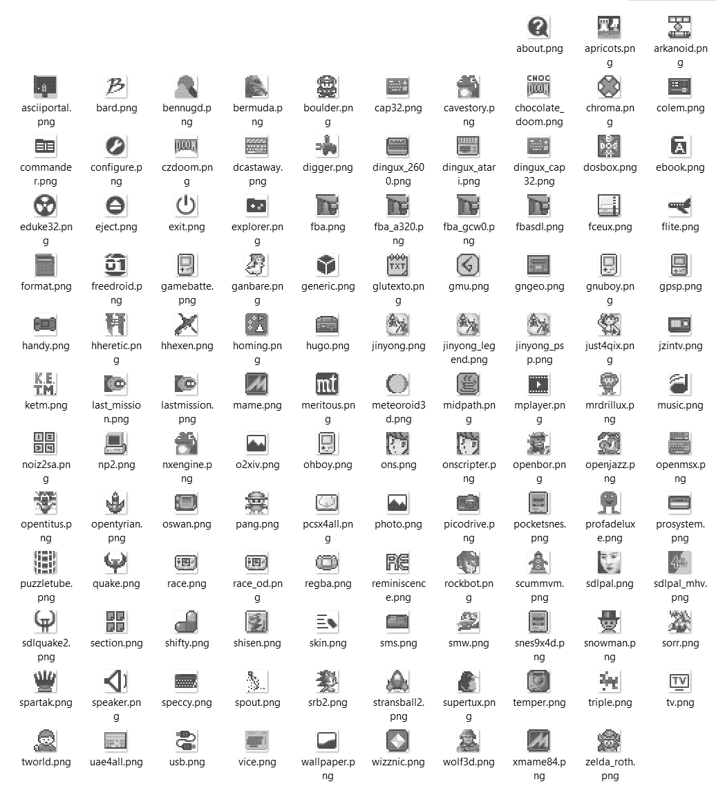

# GMenu2x skin pack for RetroGame/RS-97

** Pimp your RS-97 with my latest skins for GMenu2x! **

This skin pack changes the appearance of GMenu2x that is included in the custom firmware for this device. Please update the skins included in the latest CFW with this new version as I keep adding icons for new emulators, games and applications. All skins support the old menu style and the new GMenuNext style.

### Installation
- remove previous versions from the /skins/ folder (folders PSNext/PSNextDark/PS4/OldBoy/Zelda only)
- folders from zip file (PSNext/PSNextDark/PS4/OldBoy/Zelda) must be copied to /mnt/game/gmenu2x/skins/
- via sd card: copy folders to your external sd card and use commander app to copy them to the skins folder
- via usb: copy folders to the rom partition and use commander app to copy them to the skins folder
- go to Settings > Skin, use left/right to select skin and confirm with start
- go to Settings > Wallpaper, find the wallpaper you like the most

### PSNext

### PSNextDark

### PS4

### OldBoy

### Zelda

### Support for classic GMenu style

### OldBoy icons
